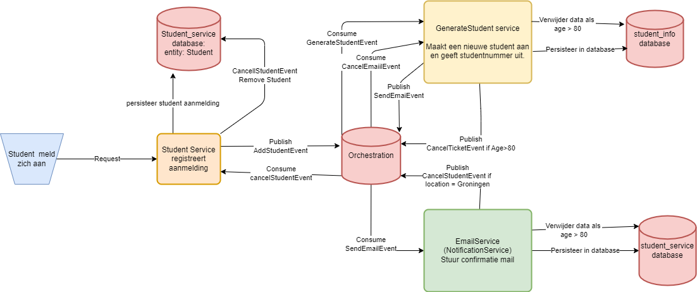

# AisSagaStateMachine
This repo demonstrates the implementation of the Saga pattern using the MassTransit library.

## Student Registration
In this scenario, three services are going to be used to illustrate the process of performing the saga pattern and managing the consistency of data. The services are:
<b>StudentService:</b> Responsible for registering a student
<b>RegisterStudentService:</b> Responsible for generating a student
<b>EmailService:</b> Responsible for sending student information to the user; current implementation is logging to database; an actual email is not sent.

As shown in the above image, a client will send a request to StudentService to register a student, then an AddStudentEvent will occur and send a message to RegisterStudentService and if the message contains valid values, it will send a message to EmailService to send a confirmation email that contains all information of student to the client. If one of the Services of RegisterStudentService or EmailService retrieves an invalid message the Cancel event will occur and incoming data will be removed from all Service's database.

## Prerequisites
- C# and .NET Core
- Visual Studio or VSCode
- Entity Framework core
- SQL server
- MassTransit
- RabbitMQ
- Docker
- Postman / Thunderclient

## Launching the project

### VSCode

A Launch configuration is provided in the launch.json file (.vscode) with the necessary configurations to start all services.